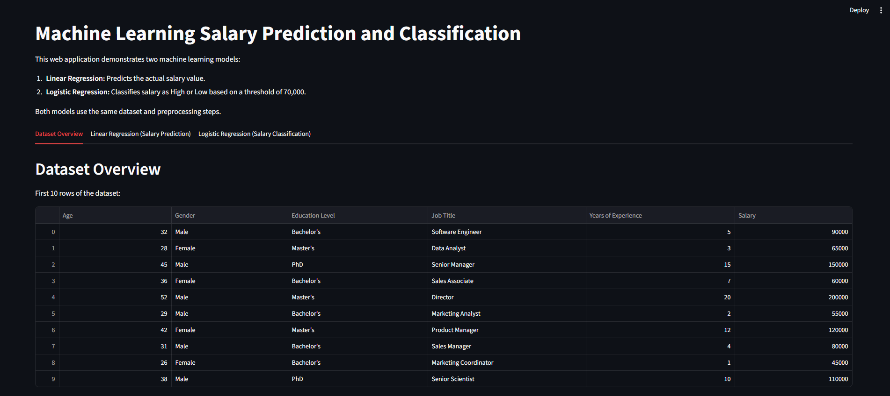
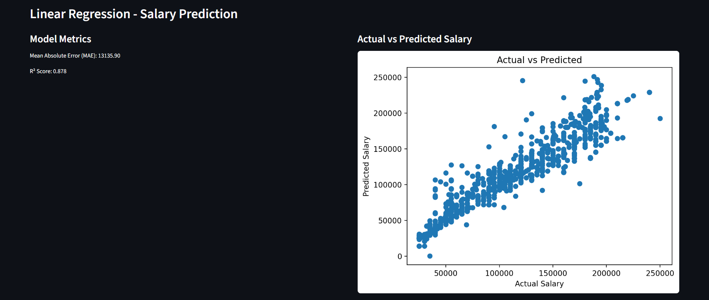
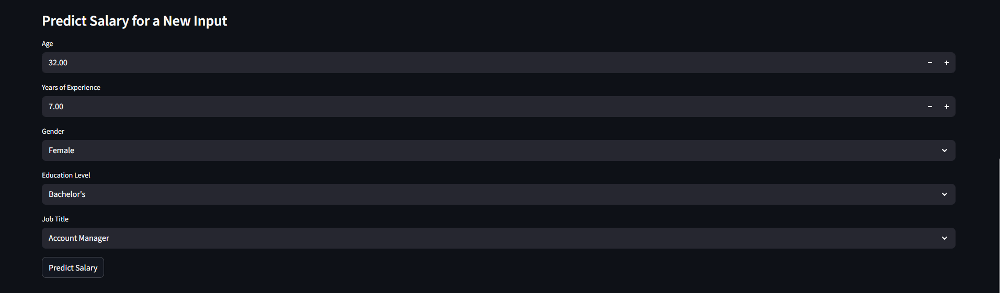
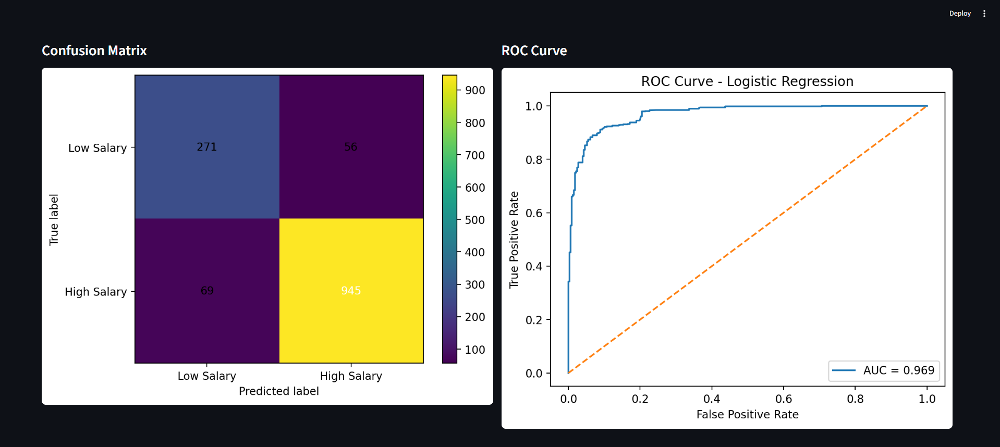

# 💼 Machine Learning Salary Prediction and Classification

This project is a web-based machine learning application developed using **Python** and **Streamlit**. It demonstrates two supervised learning algorithms applied to a salary dataset:

- **Linear Regression** for salary prediction.
- **Logistic Regression** for salary classification (High Salary / Low Salary).

The application provides an interactive interface where users can explore the dataset, evaluate model performance, and make predictions using custom inputs.

---

# 📌 Project Features

- 📊 Dataset overview
- 📈 Salary prediction using Linear Regression
- 🤖 Salary classification using Logistic Regression
- 📉 Model evaluation metrics
- 📊 Visualization of prediction results
- 📋 Interactive prediction interface using Streamlit

---

# 📂 Project Structure

```
MI-Project/
│
├── Dataset/
│   └── Salary_Data.csv
│
├── Documentation/
│   └── ML_Project_Report.pdf
│
├── Images/
│   ├── Home_Page.png
│   ├── Linear_Regression.png
│   ├── Salary_Prediction.png
│   └── Logistic_Regression.png
│
├── app.py
├── requirements.txt
└── README.md
```

---

# 📷 Application Preview

## 🏠 Home Page



---

## 📈 Linear Regression

Model performance and Actual vs Predicted Salary visualization.



---

## 💰 Salary Prediction

Predict employee salary using custom input values.



---

## 🤖 Logistic Regression

Salary classification with Confusion Matrix and ROC Curve.



---

# 📊 Dataset

The dataset contains employee information including:

- Age
- Gender
- Education Level
- Job Title
- Years of Experience
- Salary

The same dataset is used for both regression and classification tasks.

---

# 🛠 Technologies Used

- Python
- Streamlit
- Pandas
- NumPy
- Scikit-learn
- Matplotlib

---

# 🚀 Installation

Clone the repository:

```bash
git clone https://github.com/Shooqaladwani/MI-Project.git

cd MI-Project
```

Install the required packages:

```bash
pip install -r requirements.txt
```

Run the application:

```bash
streamlit run app.py
```

The application will automatically open in your web browser.

---

# 📈 Machine Learning Models

## Linear Regression

Predicts the actual salary value based on employee information.

Evaluation metrics include:

- Mean Absolute Error (MAE)
- R² Score

---

## Logistic Regression

Classifies salaries into:

- High Salary
- Low Salary

Evaluation metrics include:

- Accuracy
- Precision
- Recall
- F1-score
- ROC-AUC

---

# 📄 Documentation

The complete project report is available in the **Documentation** folder.
